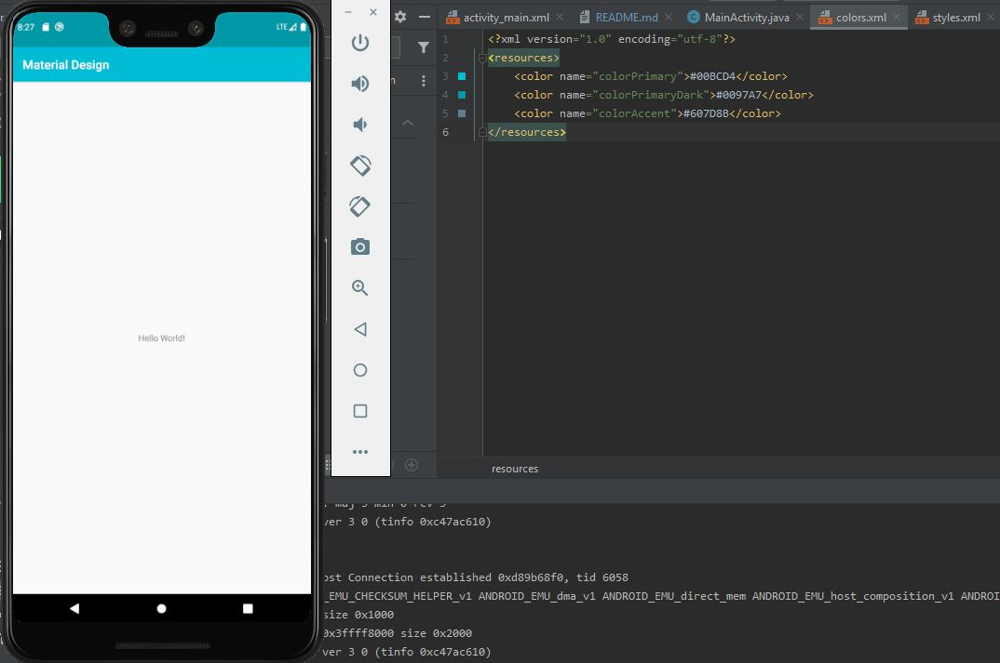

# CursoDesarrolloAplicacionesAndroidCoursera
* Este repositorio servirá para compartir proyectos de clase
#### Resultado
Al final obtendremos un resultado similar a este, aplicando el color primary detectado en la imagen, un dark color primary obtenido de materialpalette.com y el color acent

